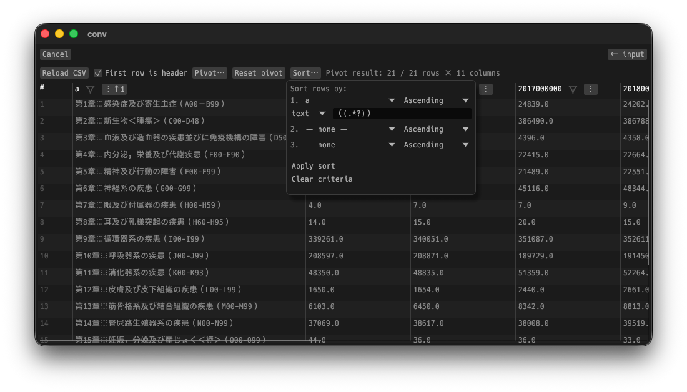

# Conv
converter tool.



## ⚠️ macOS

The macOS release archives are not notarized by Apple. After downloading and extracting
an archive from GitHub Releases, macOS may report that `conv` is damaged or cannot be opened.

Only if you downloaded the archive from this repository's GitHub Releases, remove the
download quarantine attribute and then open the application:

```bash
xattr -dr com.apple.quarantine conv.app
open conv.app
```

Alternatively, after macOS blocks the application, open **System Settings → Privacy & Security**
and select **Open Anyway**.

To inspect the quarantine attributes for troubleshooting:

```bash
xattr -lr conv.app
```

## License
The source code is licensed MIT. The website content is licensed CC BY 4.0,see LICENSE.